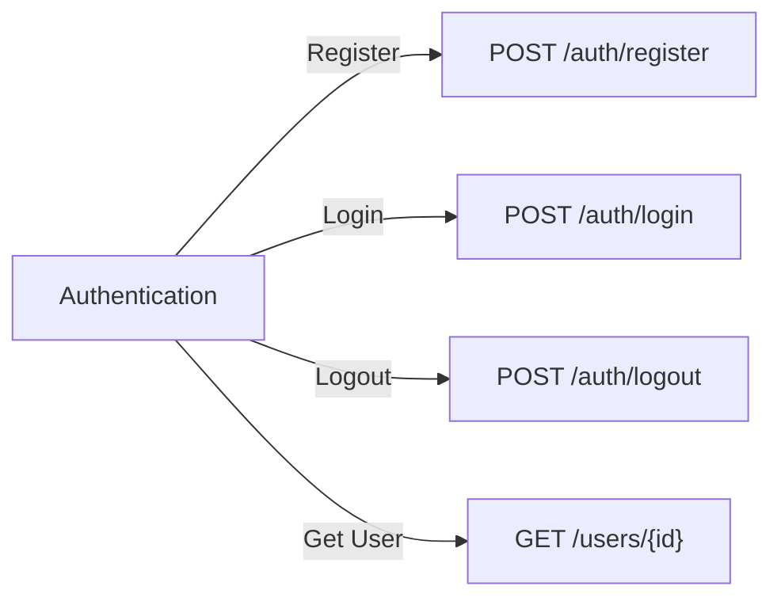
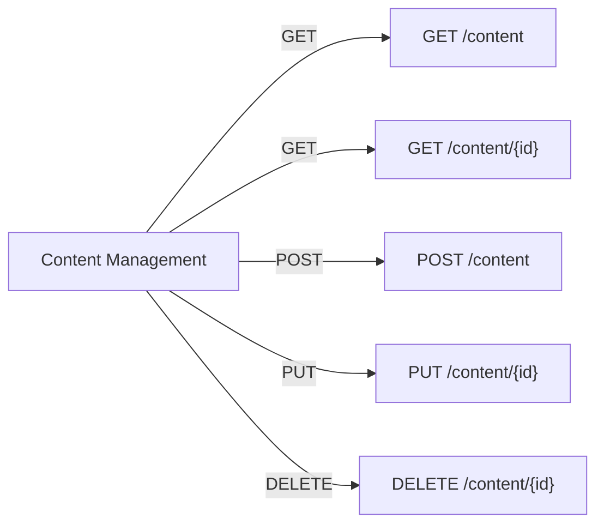
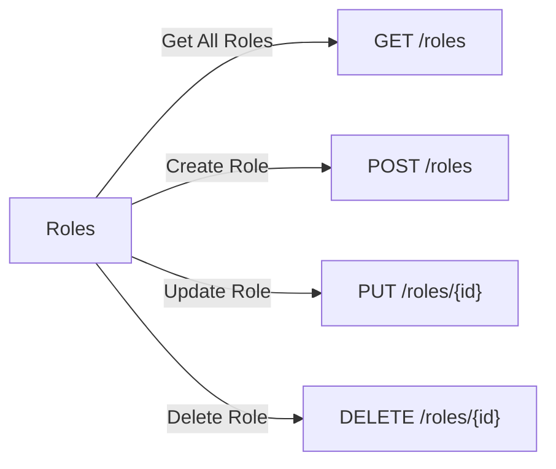
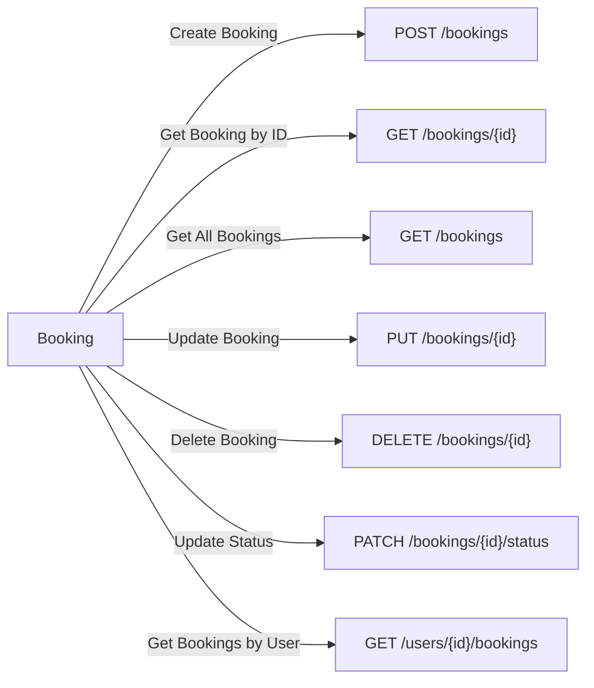
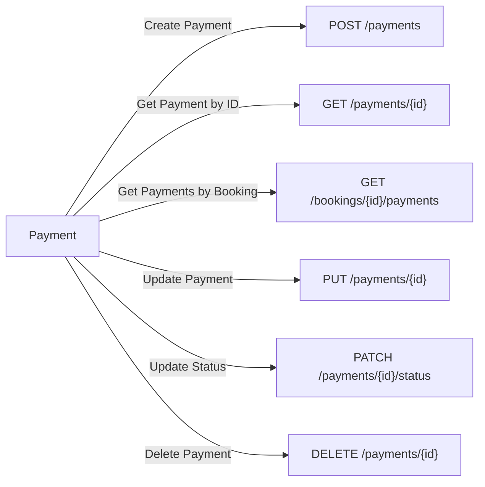
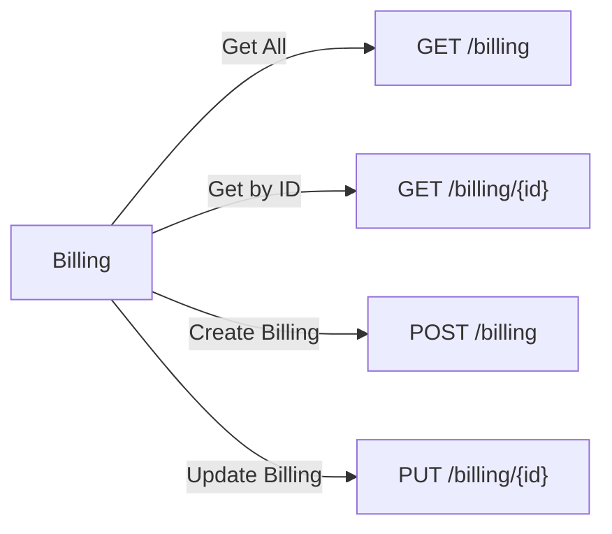
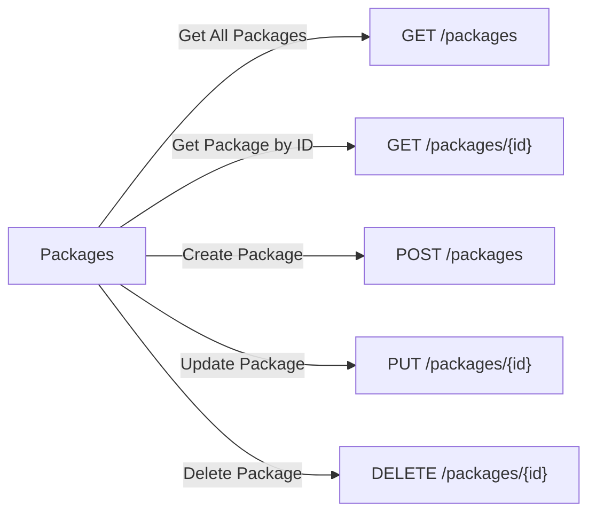
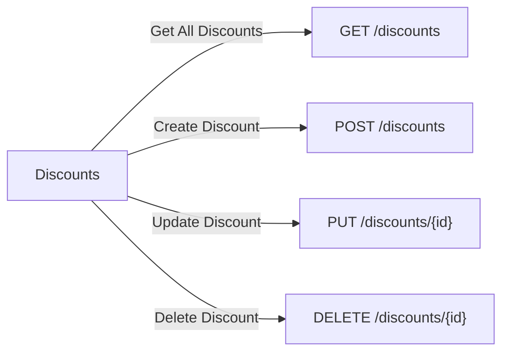
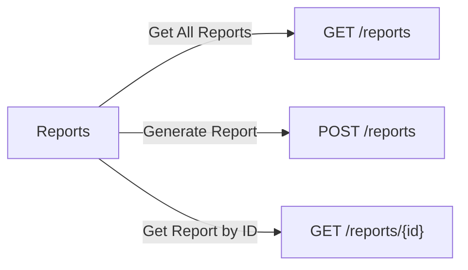

## API Endpoints
### Authentication API

---
### Content Management API

---
### Roles API

---
### Booking API

---
### Payment API

---
### Billing API

---
### Packages API

---
### Discounts API

---
### Reports API

