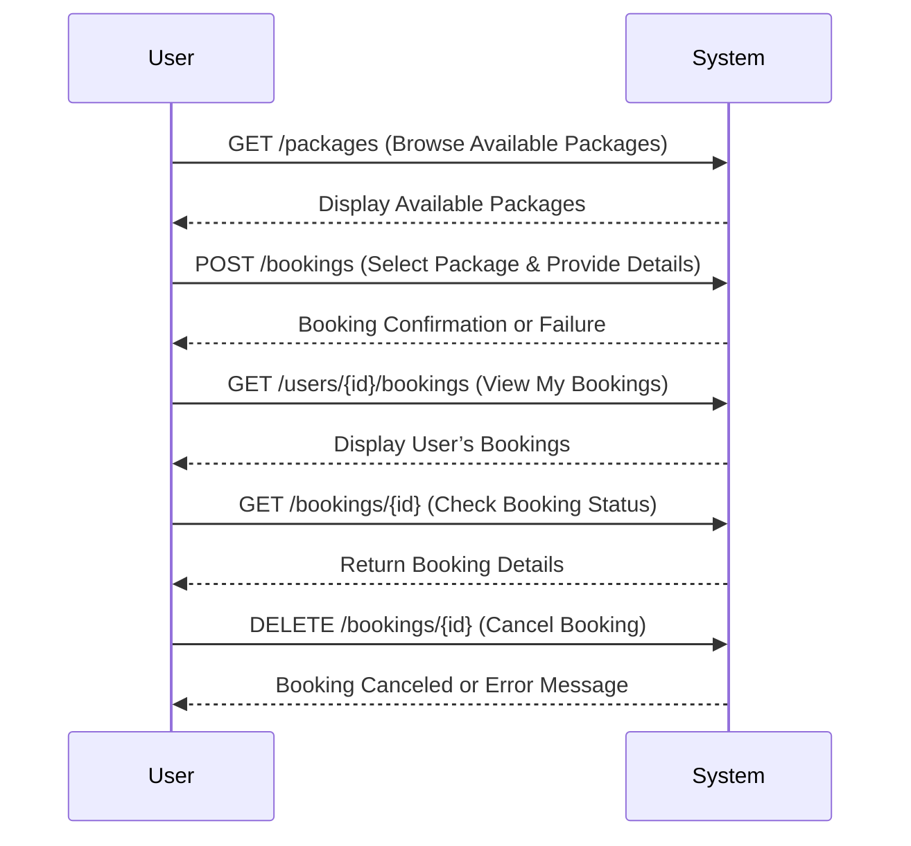
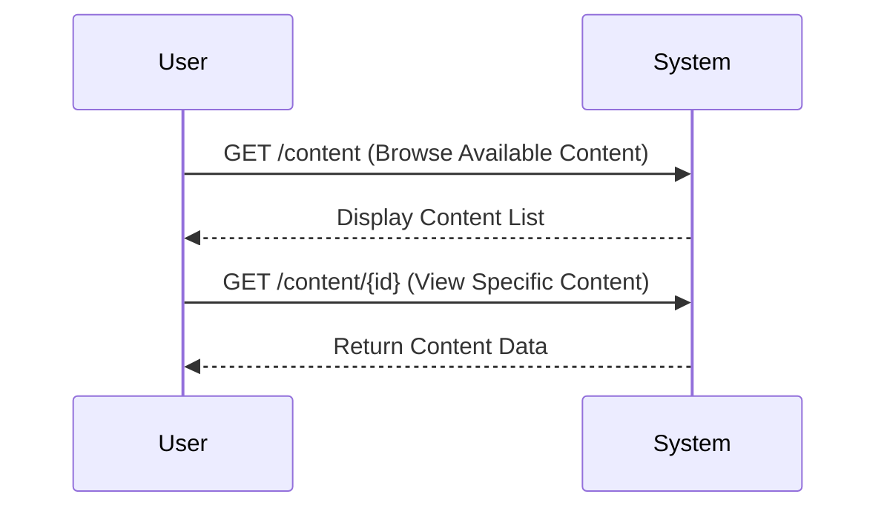
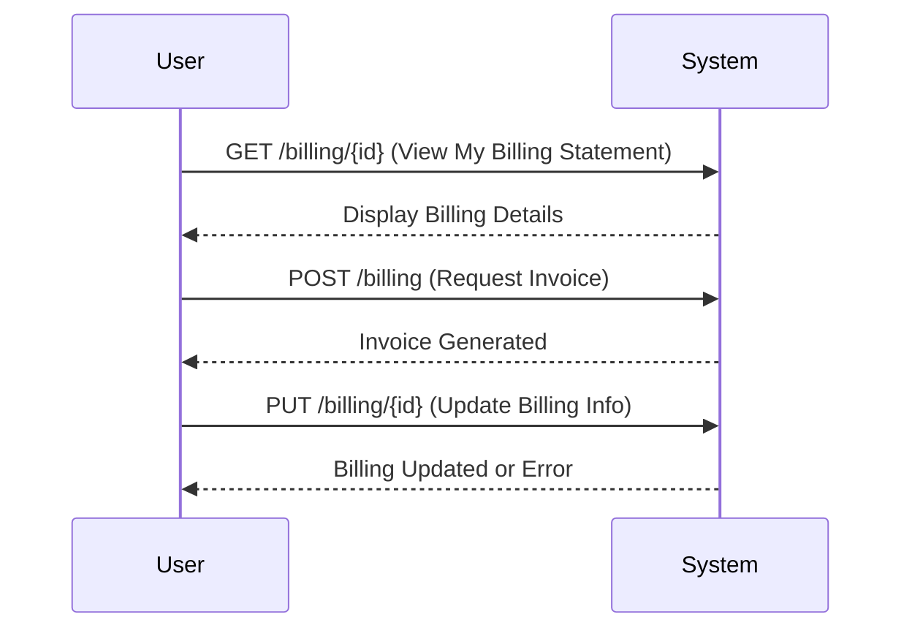

## API Endpoints
### Authentication API

---
### Content Management API

---
### Roles API

---
### Booking API

---
### Payment API

---
### Billing API

---
### Packages API

---
### Discounts API

---
### Reports API

---
Users Flow:
---
### Authentication Flow

---
### Booking Flow

---
### Packages Flow

---
### Payment Flow

---
### Billing Flow

---
### Discount Flow

---
### Access Control
| Entity              | Operation                               | Admin  | Staff  | Customer |
|---------------------|---------------------------------------|--------|--------|----------|
| **Users**          | Create (POST /auth/register)         | ✅     | ❌     | ✅ (Self) |
|                   | Read (GET /users/{id})               | ✅ (All) | ✅ (Own) | ✅ (Own) |
|                   | Update (PUT /users/{id})             | ✅ (All) | ✅ (Own) | ✅ (Own) |
|                   | Delete (DELETE /users/{id})          | ✅ (All) | ❌     | ❌       |
| **Content Management** | Create (POST /content)          | ✅     | ✅     | ❌       |
|                   | Read (GET /content)                  | ✅     | ✅     | ✅       |
|                   | Read (GET /content/{id})             | ✅     | ✅     | ✅       |
|                   | Update (PUT /content/{id})           | ✅     | ✅     | ❌       |
|                   | Delete (DELETE /content/{id})        | ✅     | ❌     | ❌       |
| **Roles**         | Create (POST /roles)                 | ✅     | ❌     | ❌       |
|                   | Read (GET /roles)                    | ✅     | ✅     | ❌       |
|                   | Update (PUT /roles/{id})             | ✅     | ❌     | ❌       |
|                   | Delete (DELETE /roles/{id})          | ✅     | ❌     | ❌       |
| **Bookings**      | Create (POST /bookings)              | ✅     | ✅     | ✅ (Own) |
|                   | Read (GET /bookings/{id})            | ✅ (All) | ✅ (Own) | ✅ (Own) |
|                   | Read (GET /bookings)                 | ✅     | ✅     | ❌       |
|                   | Update (PUT /bookings/{id})          | ✅     | ✅ (Own) | ❌       |
|                   | Delete (DELETE /bookings/{id})       | ✅     | ❌     | ❌       |
|                   | Update Status (PUT /bookings/{id}/status) | ✅ | ✅ | ❌ |
| **Payments**      | Create (POST /payments)              | ✅     | ✅     | ✅ (Own) |
|                   | Read (GET /payments/{id})            | ✅ (All) | ✅ (Own) | ✅ (Own) |
|                   | Read (GET /bookings/{id}/payments)   | ✅     | ✅     | ✅ (Own) |
|                   | Update (PUT /payments/{id})         | ✅     | ❌     | ❌       |
|                   | Update Status (PUT /payments/{id}/status) | ✅ | ✅ | ❌ |
|                   | Delete (DELETE /payments/{id})      | ✅     | ❌     | ❌       |
| **Billing**       | Create (POST /billing)              | ✅     | ✅     | ✅ (Own) |
|                   | Read (GET /billing)                 | ✅     | ✅     | ✅ (Own) |
|                   | Read (GET /billing/{id})           | ✅ (All) | ✅ (Own) | ✅ (Own) |
|                   | Update (PUT /billing/{id})         | ✅     | ✅     | ❌       |
| **Packages**      | Create (POST /packages)            | ✅     | ✅     | ❌       |
|                   | Read (GET /packages)               | ✅     | ✅     | ✅       |
|                   | Read (GET /packages/{id})          | ✅     | ✅     | ✅       |
|                   | Update (PUT /packages/{id})        | ✅     | ✅     | ❌       |
|                   | Delete (DELETE /packages/{id})     | ✅     | ❌     | ❌       |
| **Discounts**     | Create (POST /discounts)           | ✅     | ✅     | ❌       |
|                   | Read (GET /discounts)              | ✅     | ✅     | ✅       |
|                   | Update (PUT /discounts/{id})       | ✅     | ✅     | ❌       |
|                   | Delete (DELETE /discounts/{id})    | ✅     | ❌     | ❌       |
| **Reports**       | Create (POST /reports)             | ✅     | ✅     | ❌       |
|                   | Read (GET /reports)                | ✅     | ✅     | ❌       |
|                   | Read (GET /reports/{id})           | ✅     | ✅     | ❌       |

---
